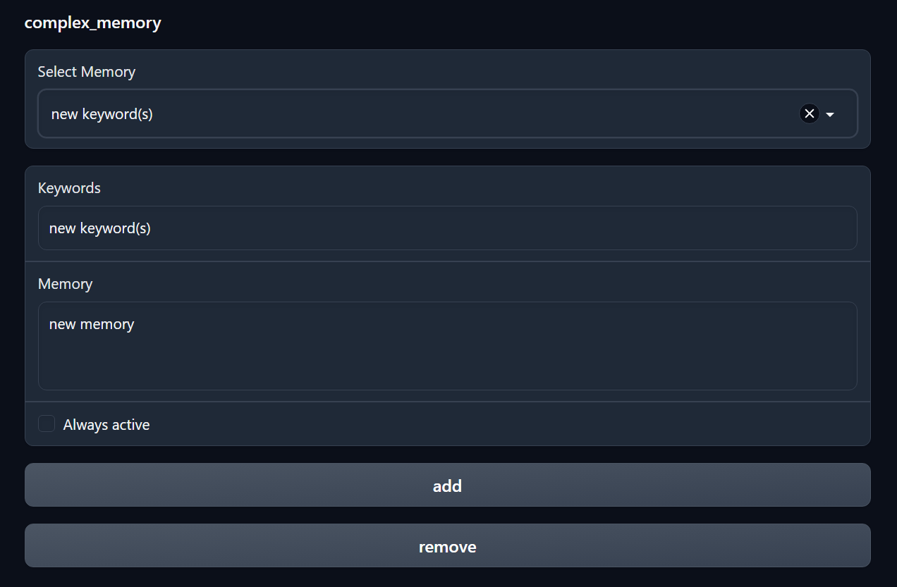
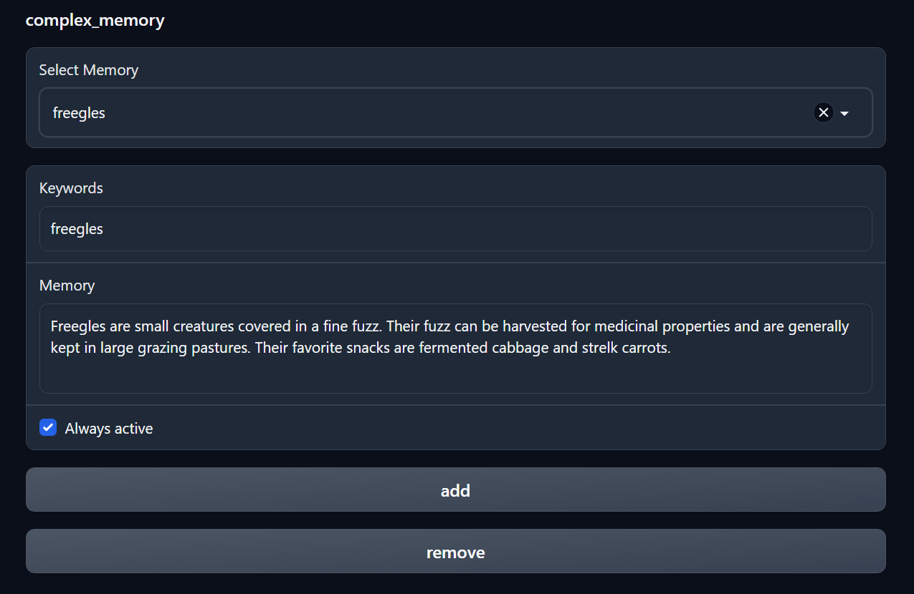
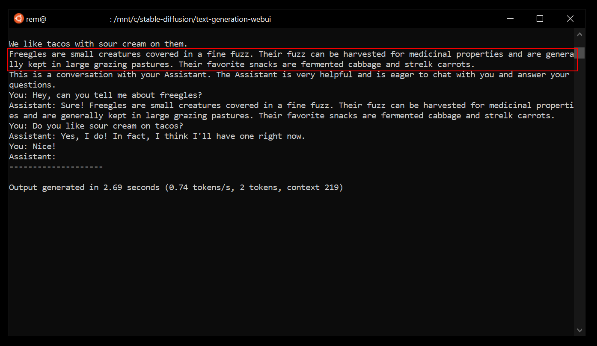

# complex_memory
A KoboldAI-like memory extension for oobabooga's text-generation-webui.




**You create memories that are injected into the `context` of the conversation, for prompting based on keywords.** 

Your keyword can be a single keyword or can be multiple keywords separated by commas.   
For example : `Elf` or `Elf, elven, ELVES`. 

The extension will add any matched keywords from your *most recent message*, along with any memories that are marked `Always active`. These get injected at the top of the conversation in the `context`, before any messages.

* The keywords are case-insensitive.  
* You can use the check box at the bottom to make the memory always active, even if the keyword isn't in your input.

**Note: This does increase your context and will count against your max_tokens.**

If you are looking for a more simple extension, you can check out my [simple_memory extension](https://github.com/theubie/simple_memory).

## Important
* **This extension requires Gradio>3.20**.  
  
As of the creation of this readme, text-generation-webui's requirement lists Gradio v3.23.0, so all new installs will work fine.  **Older installs that have not updated to the latests requirements will fail to run the extension.**

## How to install
 * Open your text-generation-webui folder with `cmd` or `terminal`.
```
cd extensions
git clone https://github.com/theubie/complex_memory
```

**OR**

* Download the zip via the green code button on the top right.  
* Extract the zip into the `extensions` folder.  
* Rename folder to `complex_memory`.
## How to enable

* Add this to your startup script:
`--extensions complex_memory `

**OR**

* Go to `Interface mode > Available extensions` and check the `complex_memory` box in your webui.  
* Apply and restart the interface.  
* *If you go this route, you will have to enable it every time you start the server.*

## Examples

Here is the memory of a small, fictional creature called a "freegle".  

We will use this fictional creature for the example because the model does not have information on it.

I also have a memory about tacos enabled.




**Both of these memories were flagged as `always` for explanation purposes.**

As you can see below, the memories are injected *before* the conversation. Here's what it looks like with the `--verbose` flag on.



Here is our information about "freegles", highlighted in red.   
It exists within the `context` of the conversation.  
And when asked about these creatures, we are given the details on it.

Our taco prompt is also present. 

## Other considerations

* Plurals of words will not be detected.   
  For example, if your keyword is `carrots`, the word `carrot` will not register. Include plurals when making keywords.
*  Dynamic insertion of keywords only takes input from your *most recent message*. If you do not mention a keyword in your most recent message, the keyword will be unloaded from the `context`. You can check the `Always active` box mid-conversation if you decide you want to permanently include a keyword.
*  The examples above were with the `alpaca-native-4bit` model. There were times it *did not* take the keywords into consideration. This is *the model being jank*, not the extension. You may have to `regenerate` responses to get exactly what you're looking for.

Memory is currently stored in its own files and is based on the character selected. I am thinking of maybe storing them inside the character json to make it easy to create complex memory setups that can be more easily shared.
